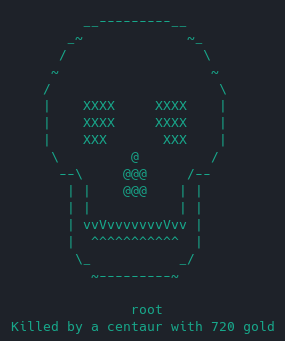
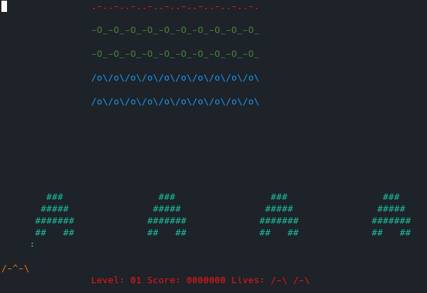
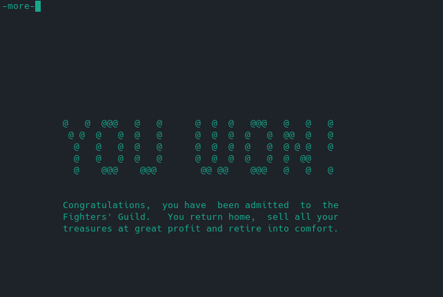

# Rogue save states using CRIU

You know [Rogue](img/rogue.png). It's what roguelikes are made of. 

But you haven't beaten it. Why is that? 

Rogue is a difficult, random game. And if you die, that's it, game over. 

You can't save your game in Rogue, so your hours are just lost.†

But using [CRIU](https://criu.org/Main_Page), we can dump running processes to disk and load them back.

So let's make a save system for Rogue. 

No code modification, no clunky VMs. Just CRIU in Docker.

## Usage

### Running

Build it: `docker build -t criu-rogue .`

Run it: `docker run -v $PWD/saves:/saves --privileged -it criu-rogue`

Play it: `tmux`, then `rogue`

### Saving

We'll be snapshotting the tmux process tree, which includes rogue.

CRIU can't snapshot it while you're attached, so detach with `Ctrl+b, d` first. 
(Ctrl+b enters the tmux Command Mode, and "d" detaches.)

Run `save save1`. This will snapshot the tmux process tree to the `/saves/save1` dir.

### Loading

Run `load save1`. It will restore the tmux process tree from disk.

Then attach to the new tmux session with `tmux attach`.

### Portability

Each save is a few megabytes. They will show up in the `saves/` subdirectory outside the container.

A save game created in one container will be usable in another container launched from the same OS.

## Notes

### Beyond Rogue

The criu-rogue docker actually works on *anything* you can run in tmux. For more games, do `apt-get install ninvaders` or `nethack-consolegames`. Save and load works the same as above.

Since you can save-state at any instant, it could be great for tool-assisted speedrunning, debugging, or AI development. 

Of course, it won't work on network-connected applications; you'd have to snapshot the Internet along with it.

### More CRIU

CRIU is a powerful and underused tool. It's not just for games! Caching the state of a whole application could skip many computations. Further, you don't need to modify the source code to use CRIU, or even have it. 

See also:

 [Critmux](https://github.com/jpetazzo/critmux) inspired this project. It connects CRIU's suspend / resume functions to Docker's start and stop features. 
 
 [Docker Checkpoint](https://docs.docker.com/engine/reference/commandline/checkpoint/) is also a thing.

### About Rogue

† Some versions of Rogue later added a save feature, but the typical Rogue on Ubuntu / Debian doesn't have one. Technically you can "save", but the save file is deleted when you load it. There's also protection against copying the file: it checks if the inode has changed. This is not easy to circumvent. You'd have to change the source code, hex-edit the save file, or do some low-level hacking on your filesystem. So snapshotting is definitely the way to go.

If you haven't played Rogue before, start with the [manual](docs/rogue-manual.pdf). To learn strategies, consult the [tables](docs/tables.md) and [tips](docs/tips.md) pages. Or consult the [source code](https://salsa.debian.org/ucko/bsdgames-nonfree/-/tree/master) itself.

Best of luck on your journey to the Amulet and back.