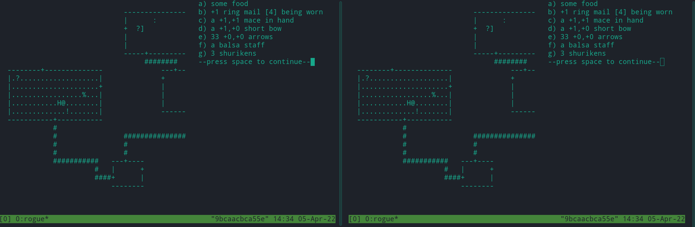

# Rogue snapshotting using CRIU

Rogue is a difficult, [unfair](img/unfair.png) game. And if you die, that's it, game over. Many hours lost. And you can't save your game in Rogue.†


But - if you can suspend the running process into files that you _can_ copy, that gives you a save feature. Forget save / load, just snapshot the whole process! 

This repo demonstrates using CRIU to snapshot a Rogue docker.

## Usage

Build it: `docker build -t criu-rogue .`

Run it: `docker run -t -i --privileged --name ro-1 criu-rogue` then type `rogue` to play

Suspend it: `docker stop ro-1`

Export the container (while suspended): `docker export ro-1 > ro-1.tgz` 

Resume the original: `docker start ro-1; docker attach ro-1`

Load exported container as a new image: `cat ro-1.tgz | docker import - ro-1-img`

Run the new image: `docker run -t -i --privileged --name ro-2 ro-1-img wrapper`

Now you have:

```
> docker ps

CONTAINER ID   IMAGE        COMMAND     CREATED          STATUS          PORTS     NAMES
719d4d975640   ro-1-img     "wrapper"   6 seconds ago    Up 4 seconds              ro-2
57fa293e8daf   criu-rogue   "wrapper"   55 seconds ago   Up 20 seconds             ro-1
```

And you've got two Rogues:


## How it works

The `wrapper` Python script catches the SIGTERM from `docker stop` and dumps the tmux state to `/state`. On resume, `wrapper` restores the tmux process along with its children. Original implementation is in the forked repo.

After stopping / starting the container, the `/state` directory is still there. If you like, you can copy its contents out as well, via `docker cp ro-1:/state .` The state dir is small (1.7 MB) - a nice alternative to creating 500MB dockers just to save and load your Rogue game. You would need to adjust the container's `wrapper` script to point at a different dir in order to load your saved state back in. A good improvement idea.

## Notes

This method can be applied to any process, of course. Rogue / Nethack types of games are just a nice example use case. Since this method lets you save at any instant in a game, it could be great for tool-assisted speedrunning, debugging, or game-playing AI development.

Since rogue is running in tmux, Ctrl+b will do tmux things rather than moving down-left fast.

† Some versions of Rogue later added a save feature, but the typical Rogue on Ubuntu / Debian doesn't have one. Instead it has a sort of pause feature. You can "save", but the save file is deleted when you load it. There's also protection against copying the file: it checks if the inode has changed. This is not easy to circumvent. You'd have to change the source code, hex-edit the save file, or do some low-level hacking on your filesystem. Snapshotting is nicer; it'll work on this, and on many other problems too.


Happy savescumming!
